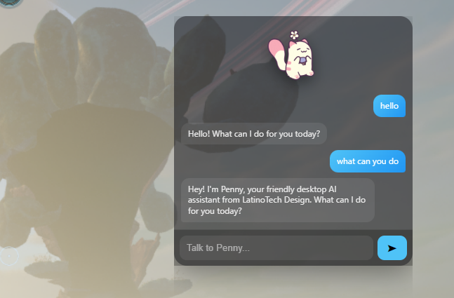

AI Desktop Chat Companion (Ollama + Electron)

Hello Dev / User,

My name is Cristopher Bermudez, and this is my simple AI desktop chat companion project.

This app uses Ollama as the local AI backend and Electron for the desktop interface.

🎬 GIF Credits

GIF assets used in this project are credited to Castaways:
https://giphy.com/Castaways

You can replace or customize your own GIFs inside the assets folder.

📁 Project Assets Structure
assets/
 ├── idle.gif
 ├── talking.gif
 ├── thinking.gif

These control the character’s animation states.

🧠 Requirements

Before running this project, make sure you have:

Node.js → https://nodejs.org/en
Electron → https://www.electronjs.org
Ollama → https://ollama.com

Example model used:
https://ollama.com/library/gemma2 (gemma:2b)

You can also use:

qwen3:4b
llama3:latest
qwen2.5-coder:3b
🚀 Setting Up Ollama (Server Mode)

To run the AI on your own PC or a second machine:

1. Enable network access

Open CMD and run:

set OLLAMA_HOST=0.0.0.0
ollama serve

This allows Ollama to be accessed over your local network.

2. Find your PC IP address

Run:

ipconfig

Look for your IPv4 address (example: 192.168.6.488)

3. Test Ollama in browser

Open:

http://YOUR-IP:11434/api/tags

Example:

http://192.168.6.488:11434/api/tags

This will show all installed models.

🔗 Connect App to Ollama

In your app.js, replace:

http://192.168.6.488:11434/api/generate

with:

http://YOUR-IP:11434/api/generate

Then update the model field:

model: "gemma:2b"

Change it depending on what you installed.

⚠️ Common Issue (Port Already in Use)

If you see this error:

listen tcp 0.0.0.0:11434: bind: Only one usage of each socket address is normally permitted.

It means Ollama is already running.

🔧 Fix Options
Option 1: Check if Ollama is already running
http://YOUR-IP:11434/api/tags

If it loads, you're good.

Option 2: Find the process using the port
netstat -ano | findstr :11434

Then:

tasklist /FI "PID eq 1234"

Replace 1234 with the PID shown.

Option 3: Restart Ollama properly

Close Ollama from the system tray, then run:

set OLLAMA_HOST=0.0.0.0
ollama serve

To make it permanent:

setx OLLAMA_HOST 0.0.0.0

Then restart Windows.

▶️ Running the Desktop App

Once everything is set up:

npm install
npm start

🛠️ Tools Used
Node.js → https://nodejs.org/en
Electron → https://www.electronjs.org
Ollama → https://ollama.com